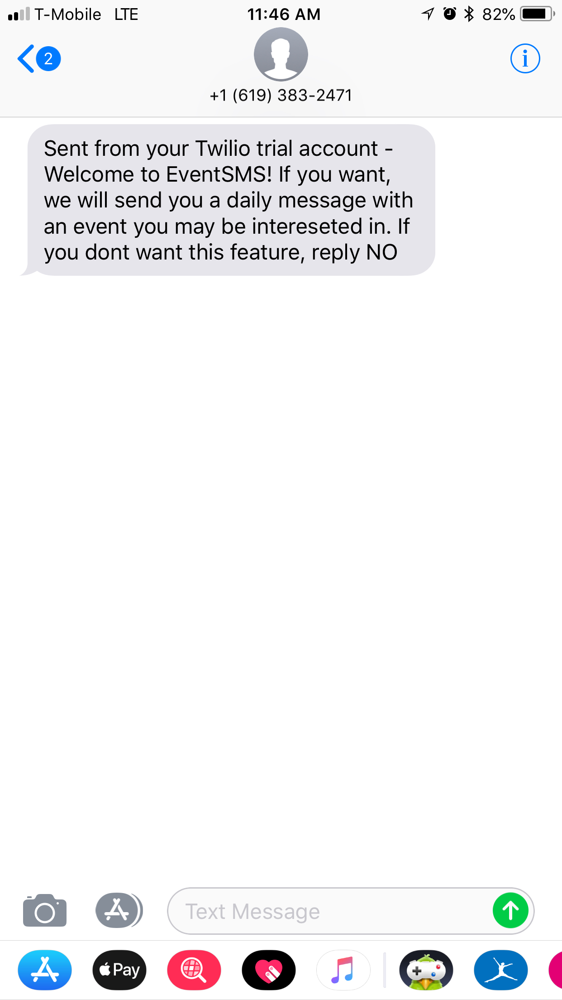

# EventSMS
## URL: [https://event-sms.herokuapp.com/](https://event-sms.herokuapp.com/)
**Index**
* [About Us](https://github.com/davidlatuno/event-project#about-us)
* [What Does Our App Do?](https://github.com/davidlatuno/event-project#what-does-our-app-do)
* [How Our App Works](https://github.com/davidlatuno/event-project#how-our-app-works)
* [Example of Text Message](https://github.com/davidlatuno/event-project#example-text-message)
* [Demo of Site](https://github.com/davidlatuno/event-project#demo-of-site)
## About Us

Here at EventSMS we strive to provide users with the best experience to find local events near by. We do this by getting to know our users and their preferences. We all come to work every day because we want to solve the biggest problem online. Everyone guessing. Our mission at EventSMS is to make searching for multiple events near by easier than 1, 2, 3. Today, we provide the most effortless way to search for the things you love in your city. We want to make this data available to as many people as possible so they will be able to enjoy these perks as well.

## What Does Our App Do?

EventSMS is a full stack web application that allows users to discover new and exciting events, restaurants, and businesses in the area in which they live. For added convenience, users can opt-in to receive daily text messages suggesting events going on around them that day, helping answer the time-old questions of "What am I going to do tonight?" or "Where am I going to eat tonight?" 

## How Our App Works

Upon first visit to the site, users are prompted with a sign up process that captures details about them that help us deliver event, restaurant, and business information. Users are asked to provide a phone number (so messages can be sent out to them), a favorite food, a category of events that the user is interested in, and location information to best suggest events, restaurants, and businesses conveniently located near the user. User data is securely stored in a database with password encryption to prevent unauthorized access.

Once users finish the sign up process, they are directed to their personalized dashboard where they can explore events based on their profile. Users can also add more preferences to their profile through the two input fields within the sidebar. These preferences are also stored in a database for data persistance.

Upon signup, users will receive a text prompting them to either opt-in or opt-out of the text message functionality. The app is perfectly useful whether or not the user has text message functionality enabled.

## Example Text Message

## Demo of Site

